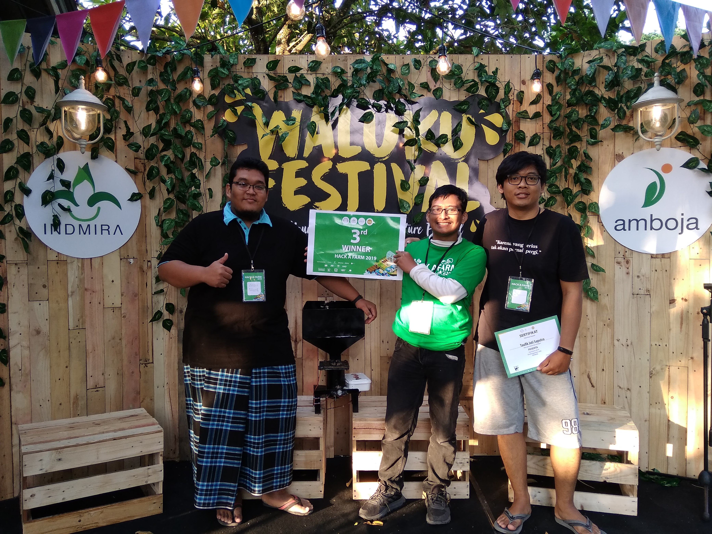

# UNAFEED

1. Backend: Node.js, Express.js
2. Database: MySQL
3. Frontend: React
4. Hardware: ESP32, Arduino
5. Code Editor: Visual Studio Code

#

3rd winner of Hack A Farm 2019 by Indmira, Yogyakarta

#

#### Lintang Wisesa :love_letter: _lintangwisesa@ymail.com_

[Facebook](https://www.facebook.com/lintangbagus) | 
[Twitter](https://twitter.com/Lintang_Wisesa) |
[Google+](https://plus.google.com/u/0/+LintangWisesa1) |
[Youtube](https://www.youtube.com/user/lintangbagus) | 
:octocat: [GitHub](https://github.com/LintangWisesa) |
[Hackster](https://www.hackster.io/lintangwisesa)
